# Campaign Companion — GM Guide

This guide walks a GM through Campaign Companion end to end: installing it, running your first session, and using everything it adds on top of Monk's Enhanced Journal (MEJ) — campaigns, the Campaign Hub, timelines, tags and the relationship graph, auto-linking, secrets, and Word import/export. It assumes you've never opened the module before.

If you're a player on a table that uses Campaign Companion, read the [player guide](player-guide.md) instead — this one is written from the GM's seat.

## What Campaign Companion adds

Campaign Companion adds a campaign-and-session layer on top of MEJ. A **campaign** is a folder of entries plus its own portal entry that opens straight into the Hub. A **Session** page type records what happened at the table. The **Campaign Hub** indexes everything campaign-relevant across six panes. On top of that you get timelines you can bind to in-world dates, tags, attributes and a relationship graph for tracking who's connected to what, automatic linking and capture, GM-managed secrets, and Word document import/export.

Everything it does builds on entries and pages MEJ already knows how to render — nothing here replaces MEJ, it extends it.

The screenshot below is the Campaign Hub — the module's home base. You'll spend most of your GM prep time here once you're set up.

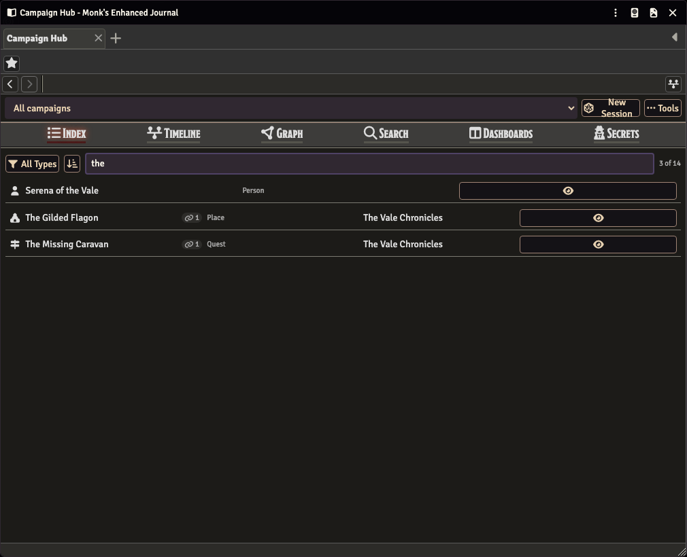

## Installation & first-time setup

1. In Foundry's **Add-on Modules** screen (Setup → Add-on Modules → Install Module), paste this manifest URL and click Install:

   ```
   https://github.com/bularzik/mej-campaign-companion/releases/latest/download/module.json
   ```

   If you'd rather install manually, download or clone the repository into your Foundry `Data/modules/mej-campaign-companion` directory (the folder name must match the module id) and restart Foundry so it picks up the new module.

2. Open your world's **Manage Modules** dialog and enable **both** "Monk's Enhanced Journal" and "Campaign Companion for Monk's Enhanced Journal". Load order doesn't matter — Campaign Companion listens for MEJ's own setup hook regardless of which module's script loads first.

3. Open **Configure Settings → Module Settings** and find the Campaign Companion section, shown below. You don't need to turn anything on to start using the module — campaigns, the Session sheet, the Hub, tags, the graph, secrets, and docx import/export all work with every setting left at its default. The five settings here (auto-link, retroactive auto-link, the two auto-capture toggles, and player-writable sessions) are opt-in conveniences you can turn on once you know you want them; [Settings reference](#settings-reference) below covers each one and when to flip it.

   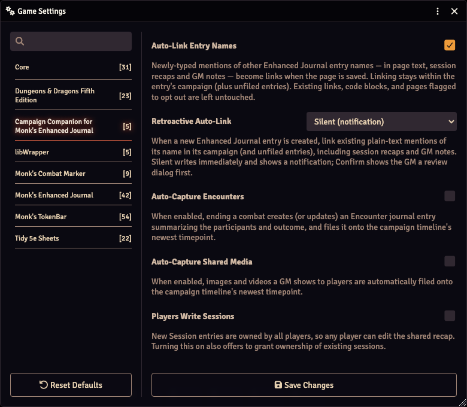

## Running your first session

Create a Session entry the same way you'd create any other MEJ entry:

1. Open the Journal sidebar tab.
2. Click the button that creates a new entry (MEJ's own "Create Entry" control).
3. In the dialog, give it a name — for example, "Session 12 — Shadows over Daggerford".
4. From the **Type** dropdown, choose **Session**. (The same dropdown also lists **Campaign**, MEJ's name for the companion's campaign page type — but make campaigns from the Hub's own picker instead, as [Campaigns](#campaigns) below describes.)
5. Confirm the dialog. MEJ opens the new Session entry.

The Hub's **New Session** button, in its header bar, does the same thing without leaving the Hub. If you're running a stock MEJ install without the extension API, **New Session** is the only route — see [Running on stock MEJ (native mode)](#running-on-stock-mej-native-mode) below.

The Session sheet has four tabs for a GM — **Recap**, **Session**, **Relationships**, and **Notes**. A player sees three of those four: no Relationships tab. Above the tabs there is no generic page-schema header; what sits there instead depends on the entry and on who is looking. A Session that carries an **image** shows MEJ's own header with that image in it. A Session with **no image** shows anyone who can edit it — you, normally — a single compact row holding the name field and an **Add image** button, so the sheet keeps its rename control and its route to a picture without spending a quarter of the window on an empty header. A player who cannot edit an image-less Session sees neither header: the tab strip is the first thing on the sheet.

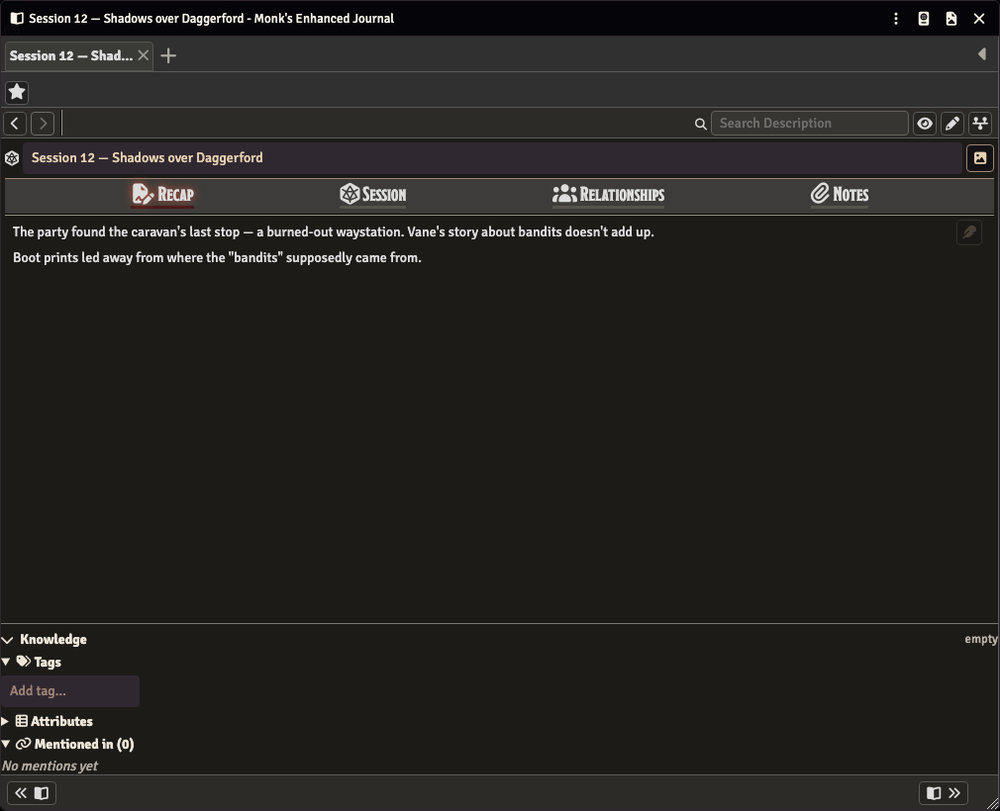

- **Recap** is where you write your own GM recap of what happened, behind the edit pencil at the right. Below it, a **Player Recaps** heading collects each player's own recap once they've written one (players write these themselves when `playersWriteSessions` is on — see [Player collaboration](#player-collaboration) — or, without that, over the GM-relay path).
- **Session** holds, in order: **Session Number**; a **Campaign Date** group of **Year**, **Month** (a dropdown: blank, then January through December), **Day**, **Hour**, and **Minute**; the **Attendees** list (drag player-character or NPC Actors onto it); the **Secrets** checklist; and a **GM Notes** block with its own **Edit GM Notes** control.
- **Relationships** is MEJ's standard relationships panel — link the session to other campaign entries from here.
- **Notes** is GM-only free text; the template hides this tab's content entirely from non-GM viewers.

One thing worth knowing before you go looking for it: the Session tab's campaign date and the Hub's **Add Timepoint** dialog are **not** the same layout. The Session tab asks for Year / Month / Day / **Hour** / **Minute** as separate fields; the Add Timepoint dialog asks for Year / Month / Day and a single free-text **Time** — see [The timeline & campaign dates](#the-timeline--campaign-dates) below.

The Session tab's **Secrets** block tracks secrets tied to this session specifically — separate from the block-level secrets covered under [Secrets](#secrets) below, though both reveal through the same audience machinery. Two icon-only buttons sit under the heading: **Add Secret** adds a row, and **Prep board** opens the session prep board. Each secret row then carries an eye-slash, an audience control, and a trash:

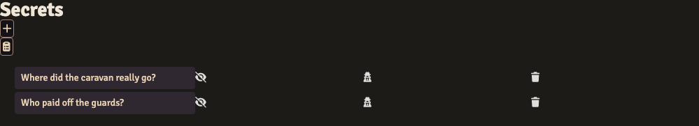

## The Campaign Hub

There are three ways into the Hub, and all of them work for players too:

- the **Campaign Hub** button in MEJ's own shell navigation;
- the **Campaign Hub** tool in the **Journal Notes** group of Foundry's scene controls;
- opening a campaign's portal entry from the journal sidebar, which lands you in the Hub already scoped to that campaign (see [The player portal](#the-player-portal)).

A **header bar** runs across the top of the Hub, above the pane tabs. Left to right it holds the campaign picker, a gear, **New Session**, and **Tools**:

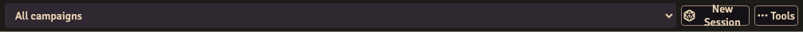

- The **campaign picker** scopes every pane. [Campaigns](#campaigns) below covers it in full.
- The **gear** is **Campaign settings**, and it appears only while the picker is scoped to one campaign — it isn't there in **All campaigns** or **Unfiled**.
- **New Session** creates a Session entry, as above.
- **Tools** opens a small menu with four items: **Import Document**, **Export**, **Auto-capture campaign**, and **Open the user guide** (which opens this document in a new browser tab; a player's Tools menu contains that one item and nothing else).

Below the header bar are **six panes**: **Index**, **Timeline**, **Graph**, **Search**, **Dashboards**, and **Secrets**, in that order. A player sees five — the Secrets tab isn't rendered for a non-GM at all. This section covers Index and Search; Timeline, Graph, Dashboards and Secrets each get their own section further down.

The **Index** is a filterable, sortable list of every campaign-relevant entry — every MEJ-typed entry (Person, Place, Quest, Shop, and so on) plus Session pages. Its toolbar holds exactly four things:

- a type filter (tooltip **Filter by Type**), whose label reads **All Types** until you check something. The menu it opens is built from the types actually present in the current scope, not a fixed list.
- a sort button (tooltip **Sort By**) offering **Name** (the default) and **Type**.
- a name box, placeholder **Filter by name...**, with a filtered count beside it once you type ("3 of 9" in the shot below).
- **File all shown into…**, which appears only in **Unfiled** scope, and only for a GM.

Each row shows a type icon — a glyph, not a portrait — the entry's name, an optional mention-count badge for incoming `@UUID` links, the type label, and the name of the campaign it's filed into. A GM's rows also carry an eye button that toggles between **Hide from players** and **Reveal to players**, and, in Unfiled scope, a **File into campaign…** folder button. A player's rows carry neither.


Once you know roughly what you're looking for, the **Search** pane is faster than scrolling the index. Its box is placeholdered **Search everything...**; type at least two characters and results appear as you type. Each result row carries the type icon, the name, the type, and a list of **field label + snippet** pairs showing where the match landed — **Description**, **Name** and **Secrets** in the shot below. Secrets and GM notes match only for a GM; a player's search never surfaces GM-only content. An empty box reads "Type at least 2 characters to search."; a query with no hits reads "No matches."

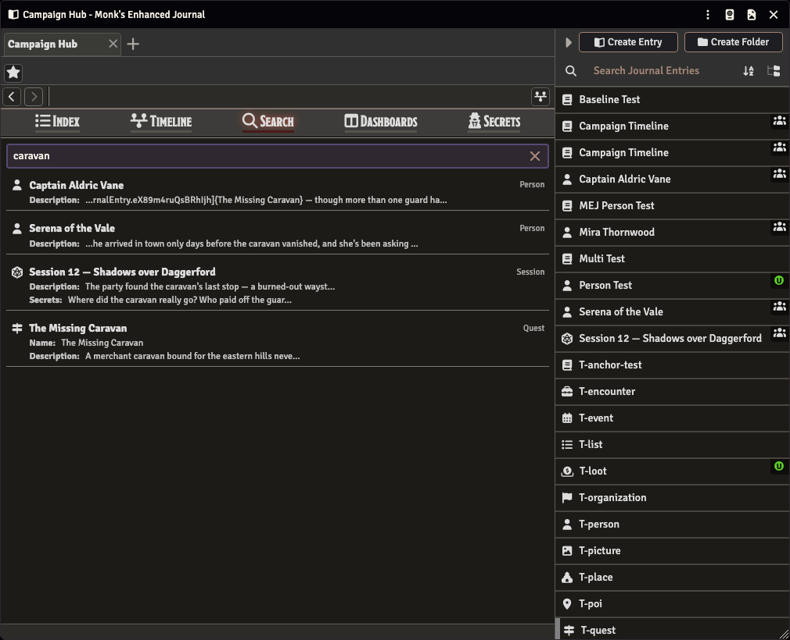

## Campaigns

A campaign is a folder in Foundry's journal sidebar plus a **portal entry** named after it. Everything filed into that folder is what the Hub means by "in this campaign".

**Creating one.** Open the campaign picker in the header bar and choose **➕ New Campaign…** (GM only — a player's picker doesn't have it). The **New Campaign** dialog asks for two things: a **Name**, and **Player access** with three options — **GM only**, **Players can view** (selected by default), and **Players can edit**. Click **Confirm** and you get the folder and its portal entry together; there's no separate step.

**Scoping the Hub.** The picker's options are **All campaigns**, **Unfiled**, then each campaign by name, then the create option. Picking a campaign narrows every pane to it and brings up the gear:

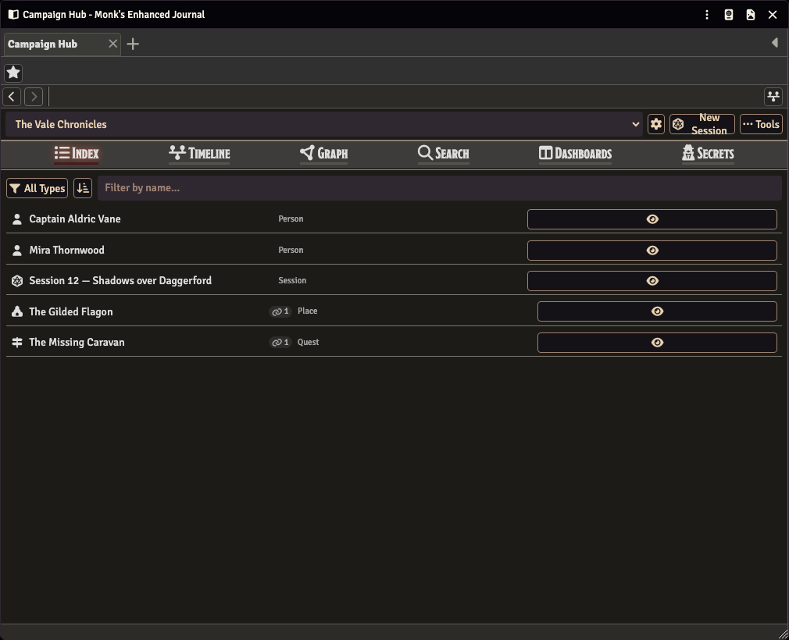

**Campaign settings.** The gear opens a dialog whose window title is the campaign's own name. It holds **Player access** (the same three options, showing the campaign's current value) and **Apply to all current members now**, checked by default — leave it checked to push the access level onto every entry already in the folder. **Confirm** saves. If the campaign's portal entry has been deleted, this dialog grows a second button, **Restore campaign entry**, which recreates the portal immediately at the campaign's own access baseline. That button is gone again the next time you open the dialog.

**Unfiled.** Choosing **Unfiled** in the picker shows every campaign-relevant entry that isn't in any campaign folder — campaign members, portal entries and timeline journals are all excluded from it. In this scope, and only for a GM, the Index toolbar gains **File all shown into…** and every row gains a **File into campaign…** button:

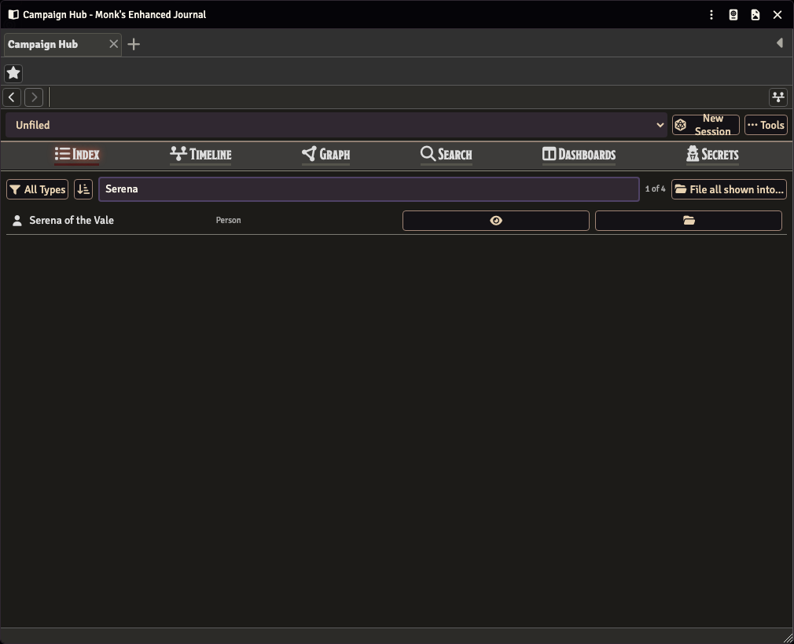

**From the sidebar.** Right-click a campaign's folder in Foundry's journal sidebar and the context menu ends with **Open Campaign Hub**, appended after Foundry's own six items (Edit Folder, Configure Ownership, Create Rollable Table, Export to Compendium, Remove Folder, Delete All). One catch: MEJ's shell window covers the sidebar's tab button while it's open, so close the shell first.

**The adoption banner.** If your world already has MEJ-typed content but no campaign, the Index pane shows a GM-only banner reading "This world has campaign content but no campaign. Create one from it?" with a **Create campaign from this world** button and a ✕ to dismiss it. It stops appearing once a campaign exists.

**Auto-capture target.** **Tools → Auto-capture campaign** picks which campaign [auto-capture](#auto-capture) files things into. Be aware that with **zero** campaigns in the world, this control and both Unfiled filing buttons still render and are still clickable, and clicking any of them does nothing at all — no dialog, no message. Create a campaign first.

## The timeline & campaign dates

The **Timeline** pane leads with a timeline picker, because a world can hold more than one timeline. Its options are **All timelines in scope** (the default), a greyed-out **— World timelines —** separator, then the timelines themselves, then a GM-only **➕ New timeline…**.

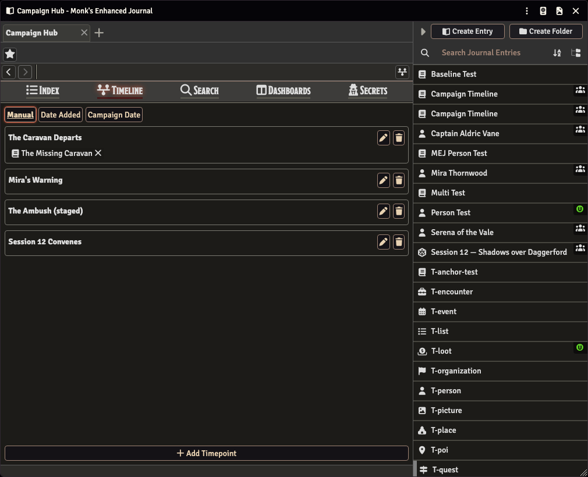

Timelines come in two flavours. **World timelines** belong to no campaign and are listed under that separator. **Campaign timelines** live inside a campaign's folder: the first time you scope the Hub to a campaign without picking a timeline explicitly, the Hub creates that campaign's timeline on the spot, named `<campaign name> — Timeline`. That first one is the campaign's default, and the picker marks a default with a **★** before its name. In **All campaigns** scope the pane stacks each campaign's default timeline under a heading bearing the campaign's name, then every world timeline under its own name.

Selecting a real timeline (rather than "All timelines in scope") brings up the GM-only management controls — **★ Make default** on a campaign timeline that isn't already the default, a pen for **Rename timeline**, and a trash for **Delete timeline**. They sit in a row beside the picker:

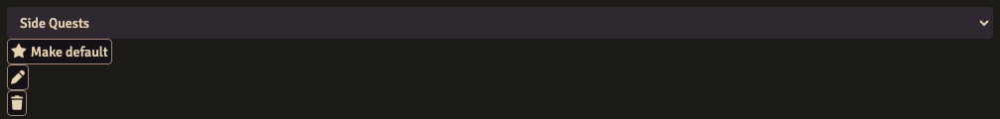

**➕ New timeline…** opens a dialog of the same name with one field, **Timeline name**, and a **Confirm** button; cancelling reverts the picker and creates nothing.

Three buttons below the picker switch how the stack orders itself: **Manual** (the default — drag entries into whatever order you want, a fractional-key drag-insert under the hood, so you can drop a new point between any two existing ones), **Date Added** (creation order), and **Campaign Date** (chronological by the in-world date you gave each timepoint, for the ones that have one).

Click **Add Timepoint** at the bottom — GM only — to create one. The dialog asks for a **Label** and, in a **Campaign Date** fieldset, a **Year**, a **Month** dropdown, a **Day**, and a **Time** that is a single free-text field. **Create** saves it:

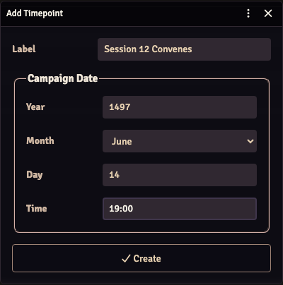

**Attaching things to a timepoint.** Drag a document onto the timepoint's row — a journal entry from the sidebar, or anything else with a UUID — and it attaches as a chip labelled with its name. This is GM-only, and the document has to belong to the same campaign as the timeline, or you get "Entries can only attach to timepoints in their own campaign." Dragging raw files off your desktop isn't supported; upload them to a journal entry first.

Dropping an **image** onto a row asks first, with a **Show Image to Players?** prompt reading `Show "<filename>" to players immediately?` Answer no and the image still attaches, but stays hidden: an attached image is invisible to players unless it's explicitly marked as shown. That's different from a document chip, whose visibility simply follows the document's own permissions. You can flip an image's visibility at any time from the eye / eye-slash toggle on its chip (tooltip **Toggle Player Visibility**), which only image chips have; the ✕ beside it removes the link. "The Caravan Departs" above carries "The Missing Caravan" as a document chip. Each timepoint row also has a pen and a trash of its own.

Two empty states are worth recognising. A timeline that exists but holds nothing reads **"No timepoints yet."** A scope with no timeline at all reads **"No timeline in this scope."** — and in that state the order buttons and **Add Timepoint** disappear entirely, leaving only the picker.

## Building your campaign record

This section covers the knowledge-layer tools: tags and attributes, backlinks, the relationship graph, and Hub Dashboards.

**Tags and attributes.** Every MEJ typed entry gets a knowledge panel at the foot of its sheet, made of three collapsible sections in a fixed order: **Tags** (open by default), **Attributes** (collapsed by default), and **Mentioned in (N)** (open by default).

Tags are free text — type into the **Add tag…** box, and each saved tag becomes a chip with an ✕ to remove it. Attributes are key/value rows, each with an eye-slash checkbox titled **Hidden from players** — check it to keep that one row off a player's view of the sheet, even if the player can otherwise see the entry — and a trash to delete the row. **Add attribute** adds another. A player sees no tag input (just "No tags") and read-only attributes.

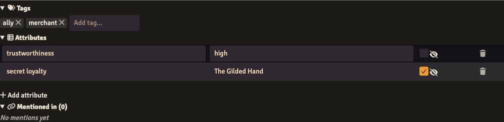

**Backlinks.** The same panel's **Mentioned in (N)** section lists every other campaign entry that links to this one via an `@UUID` link, with a ×N count per row and the total in the heading itself. A row whose only mentions come from GM-only content carries an eye-slash titled "Mentioned only in GM-only content". Empty, it reads "No mentions yet". This is also where the Index's mention-count badges come from:

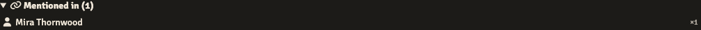

**The relationship graph.** The graph is the Hub's own **Graph** pane, sitting between Timeline and Search — there is no graph button on any entry sheet's window header in current MEJ v14 builds, so the Graph tab is the route. Three controls sit above the canvas:

- **Whole campaign** lays out everything in the current scope at once. It's the mode you land in.
- **Focus** centres on one entry and shows only its direct connections. It's greyed out unless you opened the Hub centred on an entity in the first place.
- **Show mention links**, a checkbox, layers `@UUID` backlinks on top of the relationship edges. It's off by default.

The graph is capped at the **200 most-connected** entries, for performance — additional nodes, and the links to them, are left out of the view. When that happens it says so above the canvas: "Too many entries to draw — filter to reduce (showing the most-connected 200)." Scope the Hub to a single campaign to get back under the cap.

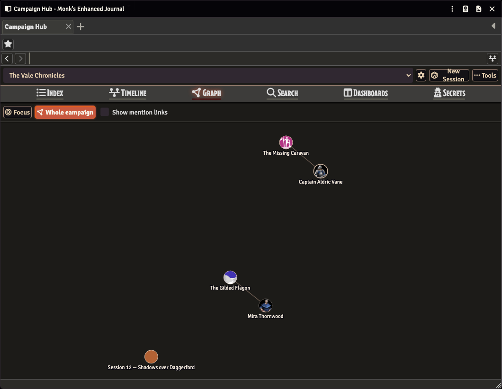

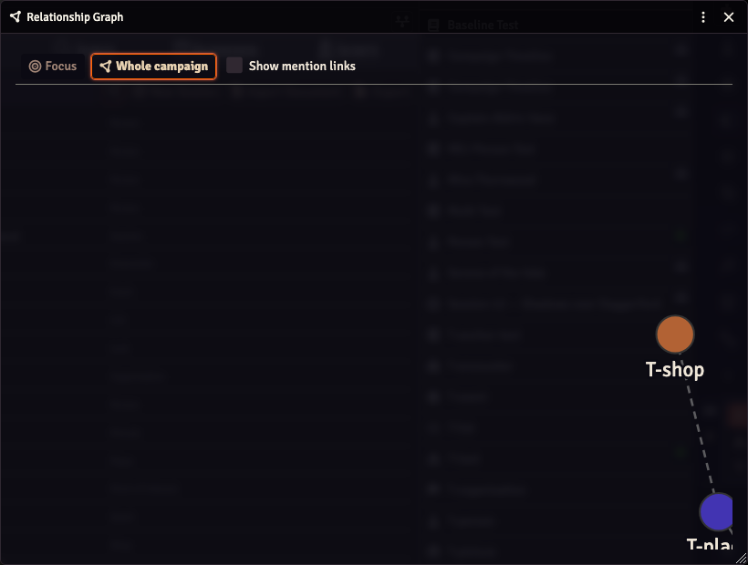

**Revealing individual relationships.** Which relationships a player can see is set on the entry's own **Relationships** panel, not on the graph. Every row there carries a GM-only audience button: **Reveal relationship** controls the row itself, and **Reveal secret relationship** controls a secret label attached to it — a hidden row that also carries a secret label gets both buttons, revealable independently. They open the same audience dialog as a secret, with the same Everyone / players / groups choices, and send the same whisper. A hidden relationship stays out of a player's relationships list *and* off their graph until you reveal it to them or to a group they're in, so a player's graph draws only the edges they've been granted.

**Portraits on graph nodes.** Each node draws the entry page's own image inside its coloured ring. Give a Person a picture on their MEJ page and that portrait is what appears on their node; an entry with no picture of its own falls back to MEJ's per-type icon, and a Session node draws a plain coloured disc with no image at all. Both branches are visible side by side in the shot above — the two Persons carry portraits, the Quest and the Place carry type icons.

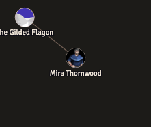

Index rows are the exception: they always show the font-awesome type glyph, never the portrait.

**Hub Dashboards.** The **Dashboards** pane holds saved searches using a simple grammar — `type:`, `tag:`, `attr:`, and plain free-text terms combined together (for example, `type:person tag:ally`). Click **Add dashboard** (GM only; a player's Dashboards pane has no controls at all) and fill in **Name** and **Query** — the dialog spells the grammar out under the query box as "Tokens: type:&lt;key&gt;, tag:&lt;tag&gt;, attr:&lt;key&gt;=&lt;value&gt;; anything else is full-text search." The third field is a **Visible to players** checkbox: leave it unchecked (the default) to keep the dashboard GM-only, or check it to let players see that saved query and its live results too. **Save** stores it.

Saved dashboards render as a row apiece — the name, the query in monospace, a pen and a trash at the right — with the matching entries listed inline underneath. An empty pane reads "No dashboards yet."; a dashboard that matches nothing reads "No matches."

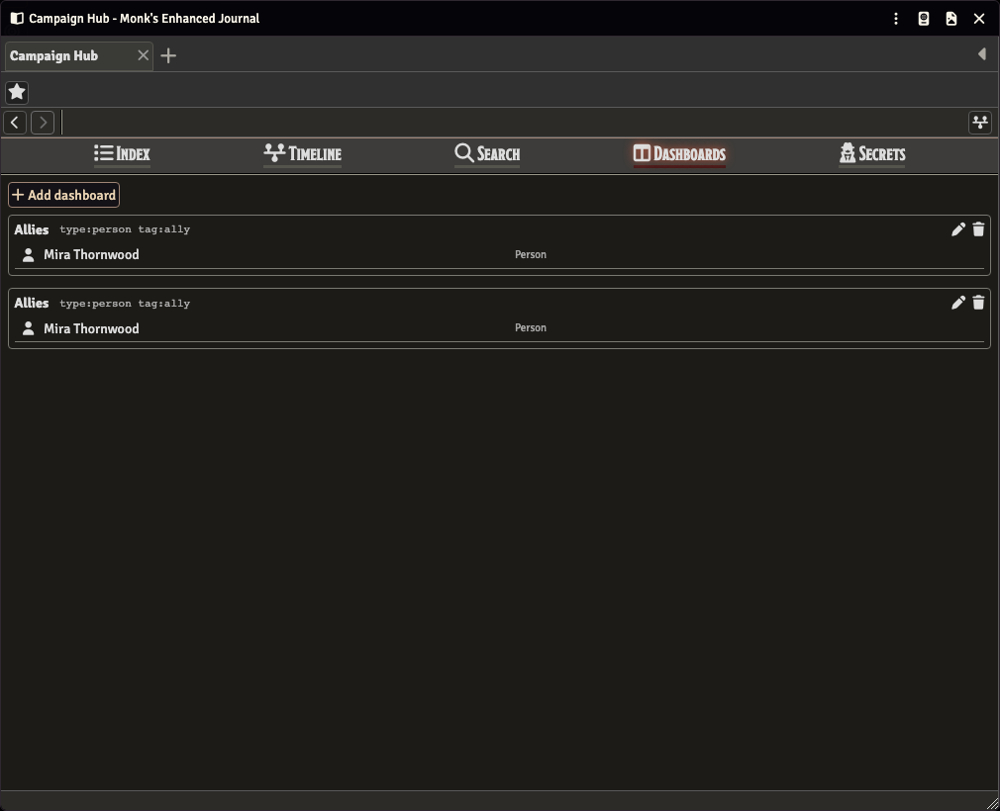

The same query syntax works as an `@CampaignQuery[...]` enricher you can drop directly into any MEJ entry's text — type `@CampaignQuery[type:person tag:ally]` and it renders its results inline wherever that text appears, the way it does on "The Gilded Flagon" below:

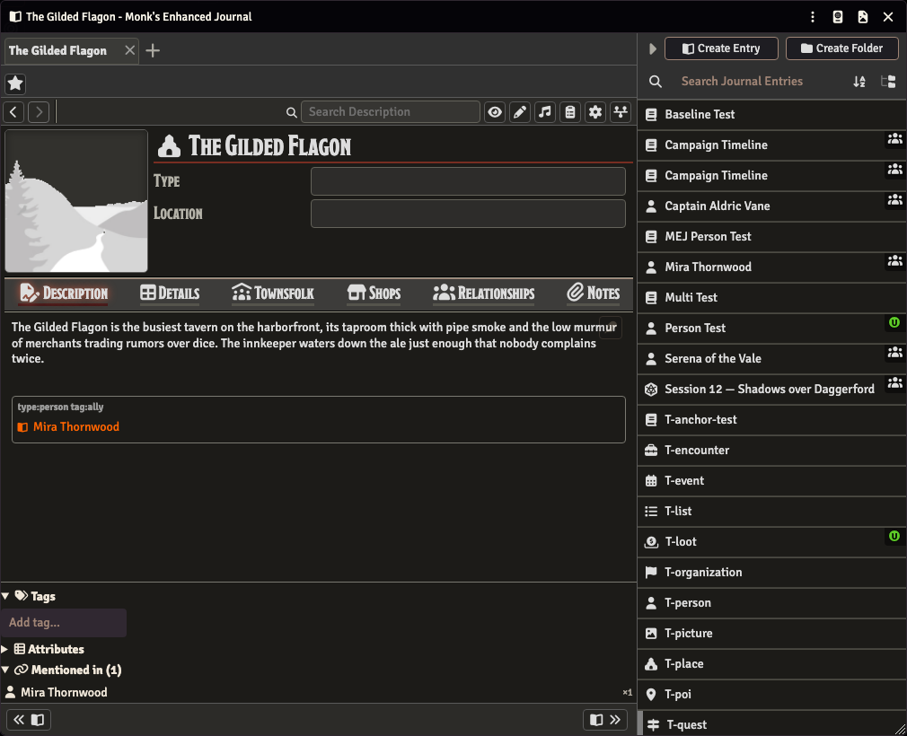

One thing to keep in mind: enricher results refresh only when the page re-renders, not live — reopen the page to see the latest matches after you've added new entries.

## Auto-linking

The **Auto-Link Entry Names** setting (off by default) turns newly-typed mentions of existing MEJ entry names into `@UUID` links automatically, as soon as you save the page. It never touches text that's already inside a link, and it never rewrites inside a code block. Any individual page can opt out entirely with its own `noAutoLink` flag.

A separate **Retroactive Auto-Link** setting (default: **Confirm (review dialog)**) handles the other direction: when you create a *new* MEJ entity, it finds existing plain-text mentions of that entity's name elsewhere in your journal and offers to link them. In Confirm mode you get a review dialog with a checkbox per matching page, like the one below — check the pages you want linked and click **Link Checked**, or **Skip** to leave them as plain text. In Silent mode it links immediately and whispers you a summary instead of asking. Off disables retroactive linking entirely.

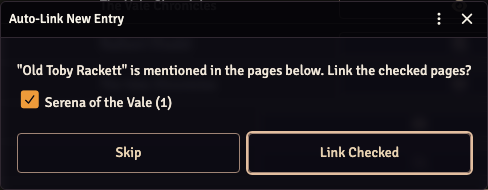

Both paths skip names that are ambiguous — shared by more than one entity in the audience — rather than guessing; ambiguous names are listed in the dialog or summary instead of being linked.

Both paths are also bounded by audience containment, stated in plain terms: a mention only ever becomes a link when everyone who can already read the page can also see the entity being linked to. A GM is exempted from that check, but a page a player can see will never get auto-linked to something that player can't.

## Auto-capture

Two more opt-in settings automate filing things onto the timeline for you, so you don't have to remember to do it by hand mid-session:

- **Auto-Capture Encounters**: when combat ends, this creates (or updates) an Encounter journal entry summarizing the participants and outcome, and files it onto the campaign timeline's newest timepoint.
- **Auto-Capture Shared Media**: whenever you use Foundry's "Show Players" on an image or video, this files it onto that same newest timepoint automatically.

Both are independent of each other and off by default. Which campaign they file into is set from **Tools → Auto-capture campaign** in the Hub's header bar — see [Campaigns](#campaigns). Neither ever blocks the operation it's hooked into — see [Troubleshooting](#troubleshooting) below.

## Secrets

Campaign Companion gives you two related but distinct ways to keep things hidden from players until you're ready to reveal them, and both reveal through the same audience machinery.

**Block-level secrets** live inside an entry's own description text — mark a block as a secret section the same way you would with Foundry's native secret blocks, on any MEJ entry that has a text region (Persons, Places, Quests, Shops, and so on). A secret that is really *about* something usually reads best on the entry it's about: in the demo campaign, the secret about the caravan ambush being staged lives on the Quest "The Missing Caravan", not on the Session page.

**Session checklist secrets** are the short clues you tick off at the table, added from the **Secrets** block on a Session's Session tab — described above under [Running your first session](#running-your-first-session).

**Recap secrets.** A secret written into a Session's **Recap** behaves the same way: the recap gets its own audience control, the secret appears in the Hub Secrets tab with a **Reveal to…** control, and a player it's revealed to sees it on their own copy of the sheet with the companion's orange rule.

Click a block secret's audience control and the **Reveal secret** dialog opens. It offers a single **Everyone** checkbox at the top, then a **Players** fieldset with one checkbox per non-GM user, then a **Groups** fieldset with one per player group. **✓ Apply** commits your choice:

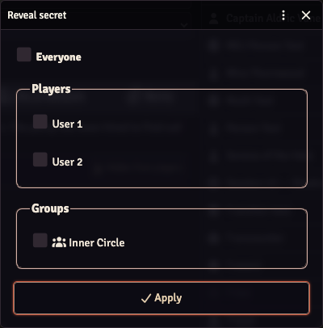

**"Everyone" is Foundry's own reveal.** Checking **Everyone** rewrites the secret section in the page's stored HTML, marking it revealed with Foundry's *own* `revealed` class rather than a module flag. That means it holds up outside this module too: on core journal sheets, for anyone at your table not running Campaign Companion, and in a player-safe Word export. Your own chip on the secret then reads **Everyone**. Reveals to named players or to a group are this module's own doing and only show up where it's installed — a player who's been cleared for one sees the section marked with the companion's orange left rule.

Secrets a viewer isn't cleared for never reach their screen intact: they're removed from the page before it's painted.

Either way, every player you reveal to gets a private whisper naming the entry the secret came from, with the secret's text and a link back to that entry:

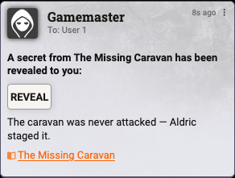

**The Hub Secrets tab** is your one list of every secret across the campaign — block secrets, recap secrets and Session checklist secrets alike. It's GM-only: the tab isn't rendered for a player at all. A filter row runs across the top with one button per entry type that actually has secrets (here **Quest** and **Session**), then the state filters **All** / **Revealed** / **Unrevealed**, then one button per player. That last group answers "what does player X know" at a glance. Each row shows the source entry, a preview of the secret, its audience — **Hidden from players** while it's still unrevealed — and its own **Reveal to…** control, so you can reveal from here without hunting down the entry. Rows reveal one at a time; the tab's advantage is that everything is already in one list, not that it reveals in bulk. Empty, it reads "No secrets tracked yet."

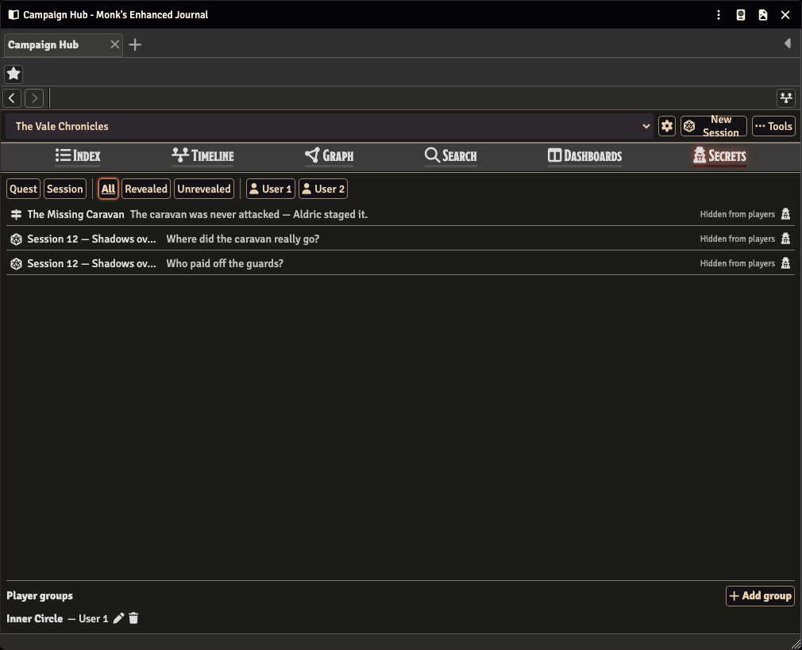

**Player groups** live at the bottom of that same tab — named collections of players that act as reveal targets alongside individual players, so you can reveal one secret to "Inner Circle" instead of checking three players individually every time. **Add group** opens a dialog asking for a **Group name** and a **Members** fieldset of checkboxes, one per player; **Save** creates it. Existing groups list with their members and get a pen and a trash. Before you've made any, the block reads "No groups defined yet — manage them on the Hub's Secrets tab."

**The session prep board** is a GM-only board for tracking reveal decisions across a session. Open it from the **Prep board** button in the Session tab's Secrets block — that button is the only route, since current MEJ v14 builds don't render any companion button on an entry sheet's window header. The board shows the session's name, its **Attendees**, a numbered **Secrets & clues** list carrying the same hide and audience controls as the checklist, **Linked entries** (or "No linked entries."), and a **Scratch notes** textarea for anything else you want on hand while running the table:

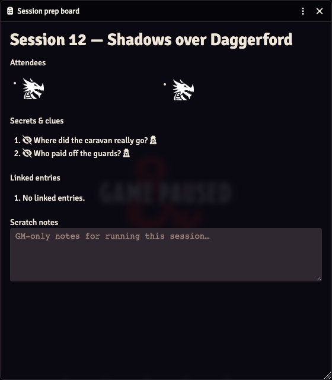

**Before you rely on any of this to protect something sensitive at the table:** secrets here are hidden by client-side filtering, the same trust model as Foundry's own secret blocks and MEJ's GM notes — the data still reaches every client that can see the page. Read the README's [secrets trust model](../README.md#secrets-layer-030) for the full statement.

## Word import & export

The docx import wizard turns a `.docx` (from Word or a Google Docs export) into MEJ entries and Session pages.

1. In the Hub's header bar, open **Tools** and click **Import Document**.
2. The wizard's first screen is only a file chooser: pick your `.docx` under **Word document (.docx)**. Its hint spells out the Google Docs route — File → Download → Microsoft Word (.docx); from Word, any .docx works. The wizard parses the file and moves to its review screen.
3. The review screen leads with three settings above the table:
   - **Import into** — which campaign the entries are created in. With no campaigns in the world the only option is **New Campaign…**.
   - **Create a subfolder named after the document**, checked by default.
   - **Audience** — **Campaign default** (the default), **GM only**, or **All players (Observer)**. This sets ownership of every entry the import creates, and it's also what bounds which entities the imported text is allowed to auto-link to.
4. Below that, a line reports how many sections were detected as sessions, then the document's name, then one table row per detected section under the columns **Title · Type · Timepoint · Adjust**. Check each row's suggested type (the wizard guesses from title keywords or a `Campaign Record type:` marker left by a prior export) and adjust it if needed; the type list runs Text and Image, Session, Person, Place, Organization, Quest, Encounter, Event, Point of Interest, Shop, Loot, List, and **Skip** to leave a section out. Sections whose heading looks like a dated header (e.g. "Session 3 — April 15, 2024") come back with the **Timepoint** box pre-checked and the detected date beside it — leave it checked to create a timepoint for that date on import. The **Adjust** column's two icon buttons merge a row into the section above it, or split one section into two.
5. Click **Import**. Import is transactional per run: entries are only created once you confirm, and if anything fails, you get a per-section warning with no partial writes.

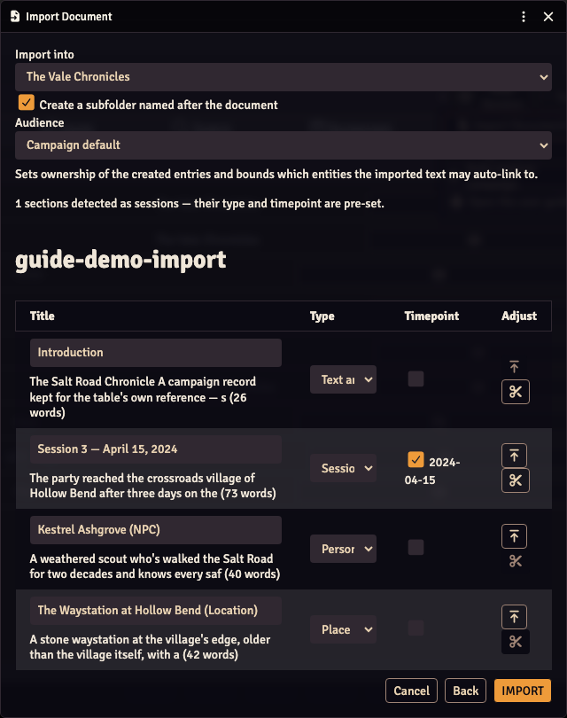

Export walks the other direction — selected entries and the timeline out into a round-trippable `.docx`:

1. In the Hub's header bar, open **Tools** and click **Export**.
2. In the **Export to Word** dialog, check the entries you want included (everything is checked by default).
3. Leave **Include GM Content** unchecked to produce a document that's safe to hand directly to players — session GM notes and relationships hidden from players are left out. Check it if this export is for your own GM-side backup or reference.
4. Click **Download**.

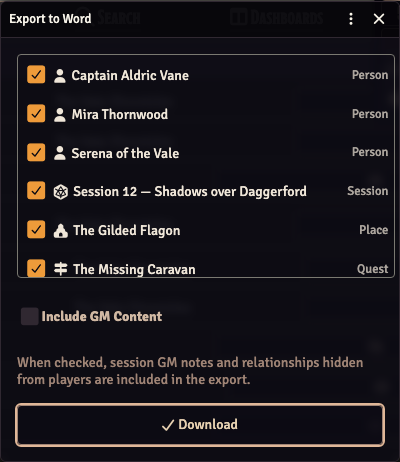

For the details of what does and doesn't survive a round trip — type markers, date-parsing behavior against non-Gregorian calendars, and the vendored libraries used — see the README's [docx round-trip notes](../README.md#docx-round-trip-notes).

## Player collaboration

Turning on the **Players Write Sessions** setting lets players write their own session recaps directly, without you relaying anything. Once it's on, new Session entries created through the docx import wizard or MEJ's own New Entry dialog are owned by all players by default, so an owning player can open the Recap tab and edit their own recap the same way you edit yours. A player's Session sheet shows three tabs rather than four — Recap, Session and Notes, with no Relationships tab.

Players who don't have Foundry's file-upload permission (or who don't have ownership at all, if the setting is off) still get their recap and inline-image writes through — those are relayed through an active GM's client instead, over the same channel MEJ uses for its own per-user notes. From a player's seat this is invisible: they just edit their recap and it saves, whichever path is actually carrying the write.

For the full trust-model detail behind that relay — what it does and doesn't protect against — see the README's [player collaboration notes](../README.md#player-collaboration-notes).

## The player portal

Every campaign gets a **portal entry** created alongside it — an ordinary-looking journal entry in the sidebar, named after the campaign, whose ownership follows the campaign's **Player access** baseline. Opening it doesn't show a page of text: it mounts the Campaign Hub, already scoped to that campaign. The window title and the shell's tab both read the campaign's name, and the campaign picker is set to it before you touch anything.

That makes the portal the thing you hand your players. Give the campaign **Players can view** access and the portal shows up in their sidebar; one click and they're in the Hub, looking at just that campaign, with everything they can't have already stripped out:

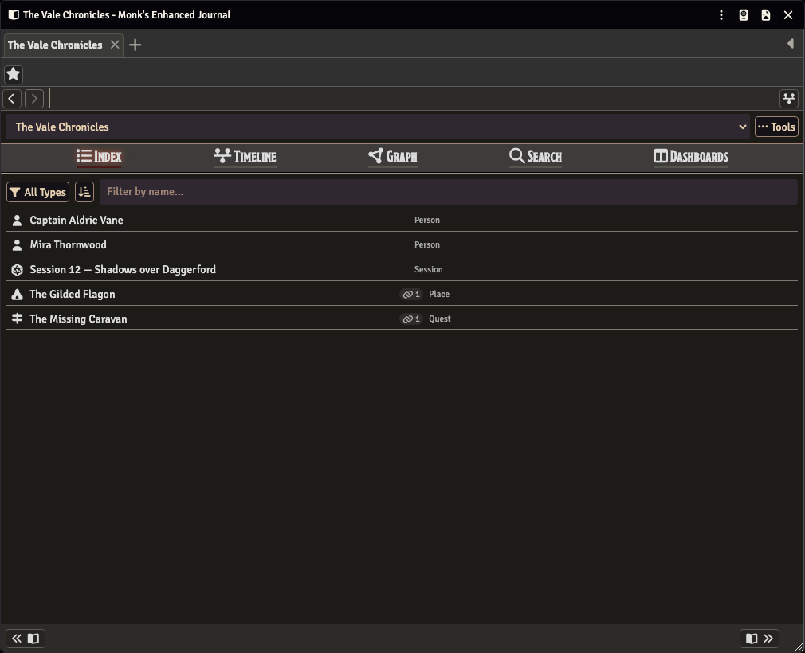

What's missing from that screen compared with your own is the whole of the GM surface: the **Secrets** tab isn't rendered, there's no **New Session** button and no settings gear, the Tools menu holds only **Open the user guide**, index rows have no hide or file buttons, the timeline picker has no **➕ New timeline…** and no management buttons, there's no **Add Timepoint** and no **Add dashboard**, and the knowledge panel is read-only. Players also see fewer entries than you do — ordinary Foundry permissions still filter the index and the graph.

If a portal entry gets deleted, you don't lose the campaign — open **Campaign settings** from the gear and click **Restore campaign entry**, as described under [Campaigns](#campaigns).

## Running on stock MEJ (native mode)

Campaign Companion works against a stock Monk's Enhanced Journal install, not just one carrying MEJ's extension API. Mode detection happens automatically and silently at startup — there's no warning, no setting to flip, and native mode is a fully supported configuration, not a degraded fallback. Everything in this guide still applies; only three things differ:

- **Session** and **Campaign** don't appear in MEJ's own "New Entry" dialog. Create sessions with the **New Session** button in the Hub's header bar instead, and campaigns from the header bar's campaign picker.
- Session pages can't be MEJ *relationship* targets (MEJ's own picker only enumerates its own registry). Companion relationships are unaffected.
- The Hub opens as its own standalone window rather than as a tab inside MEJ's shell.

Header buttons are not one of the differences, because they aren't there in either mode: as of this writing, MEJ v14 builds don't render a companion "open graph" or "prep board" button on an entry sheet's window header at all, due to an upstream MEJ header-injection bug. Both surfaces stay reachable regardless — the graph from the Hub's **Graph** tab, the prep board from its button in the Session tab's Secrets block.

If your world moves between a build with the extension API and a stock build (in either direction), no migration step is needed — a stock MEJ install strips the module's own MEJ type flag from Session pages, and an API-carrying build's GM client silently re-stamps it the next time it loads.

## Settings reference

Five settings are visible in **Configure Settings → Module Settings**, all world-scoped (they apply to everyone in the world, and only a GM can change them):


- **Auto-Link Entry Names** (default: off) — see [Auto-linking](#auto-linking). Turn this on once you have enough named entries that manually linking every mention becomes tedious; it's safe to leave on indefinitely, since it only links names that already exist and never touches an existing link or a code block.
- **Retroactive Auto-Link** (default: **Confirm (review dialog)**) — see [Auto-linking](#auto-linking). Confirm is the safer default: you review a checklist before anything gets linked. Switch to Silent once you trust the results and don't want the dialog interrupting you; set it to Off if you don't want retroactive linking at all (new-mention auto-linking on save, above, is independent of this).
- **Auto-Capture Encounters** (default: off) — see [Auto-capture](#auto-capture). Turn this on if you'd rather have an Encounter entry appear automatically after every fight than create one yourself.
- **Auto-Capture Shared Media** (default: off) — see [Auto-capture](#auto-capture). Turn this on if you regularly show players images or video during a session and want them filed onto the timeline without extra effort.
- **Players Write Sessions** (default: off) — see [Player collaboration](#player-collaboration). Turn this on if you want players writing their own recaps directly instead of relaying them through you.

A further set of settings has no UI at all and shouldn't be hand-edited — `timelineJournalId`, `savedQueries`, `playerGroups`, `forceNativeMode`, `dataVersion`, `autoCaptureCampaign`, `adoptionPrompted`, and the two per-client ones, `hubCampaignScope` and `hubTimelineSelection`. The Hub writes them for you as you use it: your current campaign scope and timeline selection, your saved dashboards and player groups, the auto-capture target, and whether you've dismissed the adoption banner. `forceNativeMode` is an internal testing escape hatch. The README's [Settings table](../README.md#settings) is the authoritative reference for every setting, visible or not, including exact defaults.

## Troubleshooting

**Startup notifications.** Campaign Companion can show one of two permanent error notifications when a world loads:

- If Monk's Enhanced Journal isn't installed or isn't active, the module disables itself and shows a notification saying so, rather than half-loading with silent failures.
- If MEJ *is* active but the module's own registration throws (a bug in Campaign Companion itself), you'll see a more specific `init-failed` notification instead, with the error logged to the console.

A world [running native mode](#running-on-stock-mej-native-mode) shows neither of these — that's a fully supported path, not an error.

**Auto-link and auto-capture never block a save.** Both are pure observers: if either one fails for any reason, the failure is logged to the console and skipped, and the underlying page-save or combat-end action that triggered it still completes normally.

**Docx import is all-or-nothing per run.** Entries are only created once you confirm the import wizard; if anything fails partway, you get per-section error messages and no partial documents are left behind.

**Filing issues.** If you hit a bug, file it at the [GitHub repository](https://github.com/bularzik/mej-campaign-companion/issues).
