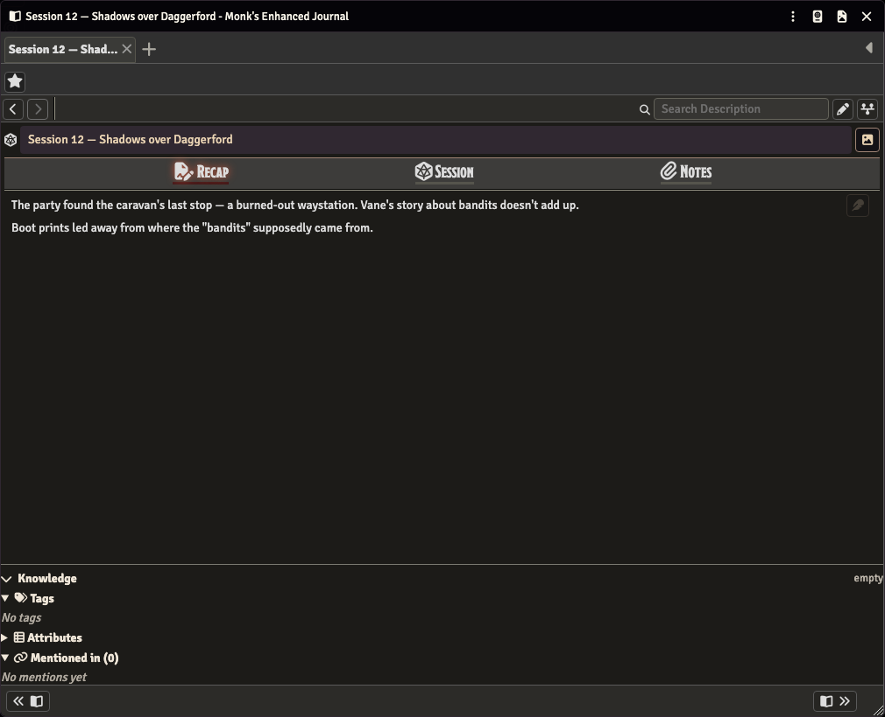
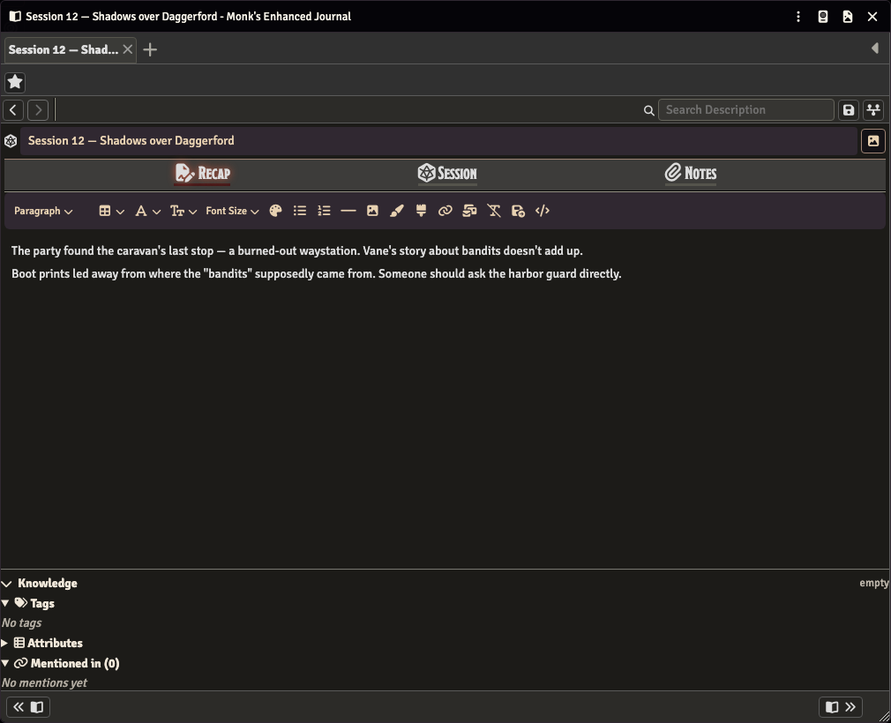
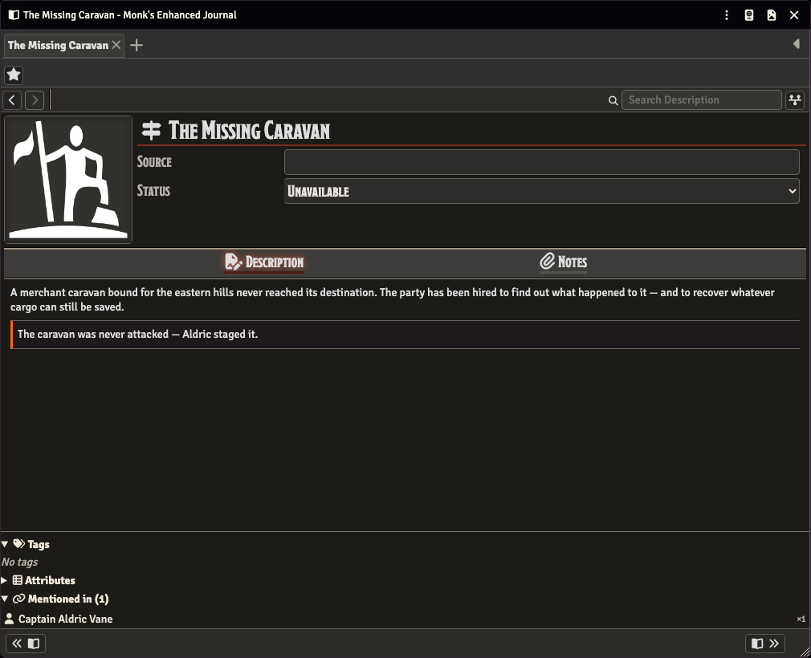

# Campaign Companion — Player Guide

If your GM runs their game with Monk's Enhanced Journal and a module called Campaign Companion, this guide covers what you'll actually see and do with it: reading and writing session recaps, finding the people and places your GM has written up, opening your campaign's portal, reading a relationship graph and a timeline, and seeing secrets as your character learns them. None of it changes how you play — it changes what you can look up and contribute to between sessions.

If you're running the game rather than playing in it, read the [GM guide](gm-guide.md) instead — this one is written from a player's seat.

## What Campaign Companion means for you

Your GM's world is organised into **campaigns** — a folder of entries plus a **portal entry** that opens straight into the module's home base, the **Campaign Hub**. Everything you can reach from your seat comes through one of three things: session pages, the Hub, and the entries your GM has shared with you.

The piece you'll interact with most directly is the **Session** page — one per game session, opened the same way as any other journal entry your GM shares with you. From a player's seat it has three tabs: **Recap**, **Session** and **Notes**.

At the top of the Recap tab is your GM's own recap of what happened. Below it, under **Player Recaps**, is space for you and the rest of the table to add your own — what your character remembers, noticed, or wants to flag for next time.

## Reading session pages & writing your recap

Your GM will let you know how to find a session page — usually by sharing it directly in Foundry, or by pointing you to it in the Hub's index (more on that below). Once it's open, the recap at the top is your GM's to write; you can read it any time, but you can't edit it.

Your own recap is the block under **Player Recaps**. Click the pencil beside it to open the editor and type your recap:

Click the pencil again to close the editor once you're done — that's the reliable way to close out. Your recap commits as soon as the editor loses focus (clicking elsewhere or navigating away both count), so if you navigate away instead, Foundry may still pop up a "You have unsaved changes" dialog. Don't let that worry you: by the time that dialog can appear your text has already been written. It's Foundry's editor being unable to tell that a saved field isn't dirty any more — its dirty flag latches on at your first keystroke and is never cleared. It's safe to answer "discard" if you see it.

If there's no pencil at all, your GM hasn't given you edit access to that session — the **Players Write Sessions** setting and per-entry ownership are both theirs to set, so ask them. One thing worth knowing if you don't own the entry outright: your recap is written through an online GM's client, so if no GM is logged in, the editor stays inactive until one is.

## Finding things

Once your campaign has more than a few sessions, you won't always remember which entry mentioned what. The **Campaign Hub** is the home base for the whole campaign, and it's open to you as well as to your GM. There are three ways in, and all of them work from a player's seat:

- the **Campaign Hub** button in MEJ's own shell navigation;
- the **Campaign Hub** tool in the **Journal Notes** group of Foundry's scene controls;
- opening a campaign's portal entry from the journal sidebar — see [The campaign portal](#the-campaign-portal) below.

A **header bar** runs across the top of the Hub. From your seat it holds two things: a **campaign picker** and a **Tools** button. The picker scopes every pane below it — it offers **All campaigns**, **Unfiled**, and each campaign you're allowed to see, but not the GM-only option for creating one. **Tools** holds a single item for you, **Open the user guide**, which opens this document in a new browser tab. Your GM's header bar has more on it: a settings gear and a **New Session** button that aren't rendered for you.

Below the header bar are the panes. **You see five** — **Index**, **Timeline**, **Graph**, **Search** and **Dashboards**. Your GM sees a sixth, **Secrets**, which isn't rendered for a non-GM at all.

The **Index** lists every campaign-relevant entry you can see: each of your GM's typed entries (Person, Place, Quest, Shop, and so on) plus Session pages. Its toolbar gives you a type filter (labelled **All Types** until you check something, and built from the types actually present rather than a fixed list), a sort button offering **Name** or **Type**, and a **Filter by name...** box with a count beside it once you type. Each row shows a type glyph, the name, a mention-count badge where other entries link to it, the type, and the campaign it's filed into. Your GM's rows also carry hide and file buttons; yours carry none.

The **Search** pane is faster than scrolling the index once you know roughly what you're after. Its box is placeholdered **Search everything...**; type at least two characters and results appear as you type, each row naming the field the match landed in:

(That shot was taken from the GM's own seat — you can tell by the six tabs and the **New Session** button. It includes a **Secrets:** match line under Session 12 that a player's results would never turn up. Your own search only ever reaches what your permissions allow, the same rule that governs everything else in this guide.) One cosmetic wrinkle you may notice: snippets are taken from the raw page text, so a link can show through as `@UUID[...]` markup mid-sentence. It's only the preview that looks like that; the entry itself reads normally.

Every entry also has a **Mentioned in (N)** panel at the foot of its sheet, listing which other entries link to it with a ×N count each — handy for tracing how two people or places you've heard of connect. It sits alongside **Tags** and **Attributes** in the same panel; from your seat all three are read-only, and an entry with no tags reads "No tags".

The **Dashboards** pane holds saved searches your GM has built. You'll see the ones they marked **Visible to players**, with their live results listed underneath — a ready-made search, filtered the same way as everything else. There are no controls on it from your seat, and an empty pane reads "No dashboards yet."

## The campaign portal

Every campaign has a **portal entry** — an ordinary-looking journal entry in your sidebar, named after the campaign. If your GM has given the campaign player access, it shows up for you like any other entry. Opening it doesn't show a page of text: it mounts the Campaign Hub, already scoped to that campaign, with the window title and the shell's tab both reading the campaign's name.

That makes the portal the easiest thing to bookmark: one click and you're in the Hub looking at just that campaign, with everything you're not allowed to see already stripped out. In the shot above the index holds the five entries this player can reach — two Persons, a Session, a Place and a Quest — and the rows carry no hide or file buttons, because those are your GM's.

One quirk to expect at the bottom of the portal page: because the portal is a typed page like any other, the **Tags** / **Attributes** / **Mentioned in** panel renders underneath the Hub there too. On a portal it's normally empty ("No tags", "Mentioned in (0)"). It's harmless.

## The relationship graph

The Hub's **Graph** pane is a visual map of how people, places and other entries connect, built from the relationships your GM has drawn between them. It's a tab of its own, sitting between Timeline and Search — there's no graph button on an entry sheet's window header.

Three controls sit above the canvas, and they're identical to your GM's:

- **Whole campaign** lays out everything in the current scope at once. It's the mode you land in.
- **Focus** centres on one entry and shows only its direct connections. It's greyed out unless you opened the Hub centred on an entity in the first place.
- **Show mention links**, a checkbox, layers plain `@UUID` mentions on top of the relationship lines. It's off by default.

Each node draws the entry's own picture inside a type-coloured ring — the two Persons above carry portraits their GM gave them, while the Quest and the Place fall back to a type icon and the Session node is a plain coloured disc with no image. (Index rows never show the portrait; they always draw the glyph.)

Don't be surprised if your graph looks sparser than what your GM sees on their own screen. You'll see every entry that's relevant to you, but a line only appears between two of them once that specific relationship has been made visible to you. A node sitting there with no lines — "Session 12 — Shadows over Daggerford" above — just means the graph knows about it, but not (yet) how it connects to anything else from where you're standing.

When your GM does reveal a relationship to you, it turns up in two places: as a new line on the graph, and on the entry's own **Relationships** list, where a connection that had been hidden from you appears as a fresh row (or, if it can't be slotted into the existing list, under a heading of its own reading "Known connections"). A relationship that was already visible but carried a hidden note gets that note added inline instead, marked with an eye icon.

One thing to expect on a big campaign: the graph draws at most 200 entries at a time. Past that it shows the notice "Too many entries to draw — filter to reduce (showing the most-connected 200)." and keeps the most-connected ones — narrow the campaign picker's scope if you hit it.

## When secrets are revealed to you

Some entries in your GM's campaign hold secrets — things your character doesn't know yet. Until one is revealed to you it isn't merely hidden: secrets you aren't cleared for are stripped out of the page before it's drawn, so they never reach your screen at all. There's also no Secrets tab in your Hub; that pane is GM-only.

When your GM reveals one, you get a private whisper in your chat log naming which entry the secret came from, with its text and a link straight back to the entry:

From then on the secret is also on the entry's own page. What it looks like there depends on how your GM revealed it:

- **Revealed to you, or to a group you're in** — the block carries Campaign Companion's own marker, an orange rule down its left edge, so you can tell at a glance which part of the page you've only just been let in on:

- **Revealed to everyone** — the block is marked with Foundry's *own* reveal rather than the module's, so it reads as ordinary page text with no orange rule. The upside is that it holds up outside the module: it stays revealed on core journal sheets and in a player-safe Word export. You may also notice a small **Hide** control that core Foundry draws on such blocks; that's Foundry's own control, not part of Campaign Companion, and nothing here asks you to use it.

The same applies to secrets your GM tucked into a session recap rather than an entry description: once one is revealed to you, it appears in the recap on your own copy of the session sheet, with the same orange marker.

If you're curious how your GM manages reveals behind the scenes, that's covered in the [GM guide's secrets section](gm-guide.md#secrets) — though it's worth asking your GM directly, since it's their call how and when things get revealed.

## The campaign timeline

The Hub's **Timeline** pane lays out your campaign's key moments in order — a running record your GM builds up as the story goes, sometimes tied to an in-world date, sometimes not:

The pane leads with a **timeline picker**, because a world can hold more than one. Its options are **All timelines in scope** (where it starts), a greyed-out **— World timelines —** separator, and then the timelines themselves; a **★** before a name marks the campaign's default. Your GM's picker also has a **➕ New timeline…** option and rename/delete controls beside it — yours has neither.

Three buttons below the picker change how the list is ordered, and all three work from your seat: **Manual** (the order your GM arranged them in), **Date Added** (when each one was created), and **Campaign Date** (the in-world date, for the timepoints that have one). A timepoint can also carry an attached entry, shown as a chip on its row — "The Caravan Departs" above links straight through to The Missing Caravan.

Attachments follow the same permission rule as everything else, with one extra twist. A linked entry only shows on your row if you're allowed to open it. An attached *image* is stricter still: it stays off a player's timeline entirely unless your GM has explicitly ticked it as shown to players, so a picture your GM has staged for a later reveal won't appear on your row before then.

(The shot above is from the GM's seat. **+ Add Timepoint** at the bottom isn't rendered for you, and the pen and trash on each row are your GM's editing controls. What you get is the same timeline, read-only: the labels, the order, and anything attached to each point.) Two empty states are worth recognising: a timeline that exists but holds nothing reads "No timepoints yet.", while a scope with no timeline at all reads "No timeline in this scope."

## Quick answers

**Why can't I see X?** Almost everything in Campaign Companion — index rows, search results, graph nodes and edges — filters to what your Foundry permissions allow. If something's missing, it's not a bug; it just hasn't been shared with you yet.

**Why didn't my name get linked?** When your GM types a name and it turns into a clickable link automatically, that only happens when every reader of that page would also be allowed to see what it links to. If a link would point somewhere you or another reader of that page can't see, it's left as plain text instead.

**Where's the Secrets tab?** There isn't one for you. The Hub renders five panes for a player and six for a GM; **Secrets** is the GM's own tracker for everything they've hidden and everything they've revealed.

**Can the GM read my recap?** Treat it as public — recaps live on the shared session page, not in a private note between you and your character. Worth knowing, though: in the build this guide was written against, a GM's own Recap tab showed only their own recap slot rather than the players' recaps, even where a player's recap existed and rendered fine on the player's own sheet. So if there's something you want your GM to have read, say so rather than assuming they've seen it.

**Why does a search snippet look like code?** Snippets come from the raw page text, so a link inside a matched sentence shows through as `@UUID[...]` markup. The entry itself is fine — it's only the preview.
